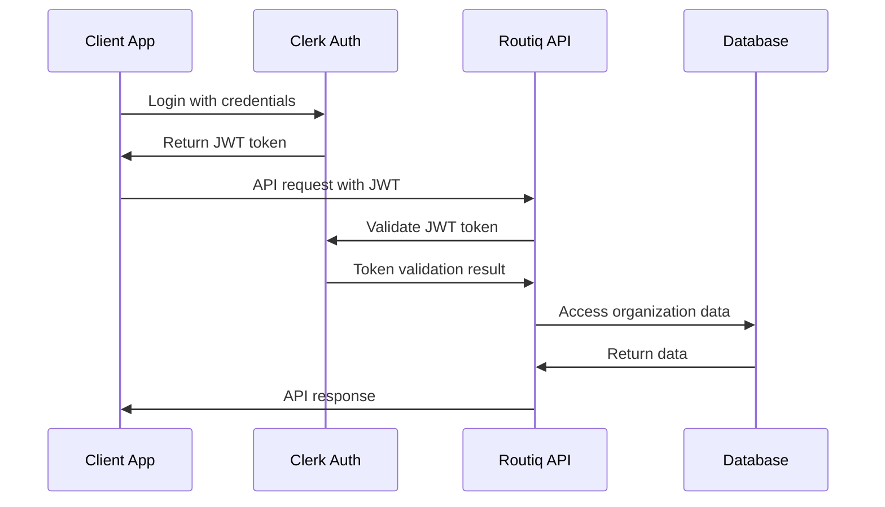

## Overview

Routiq uses **Clerk JWT (JSON Web Token) authentication** to secure all API endpoints. This provides enterprise-grade security while maintaining ease of use for developers.

<Info>
  **All API endpoints** (except `/` and `/health`) require authentication. Unauthenticated requests will receive a `401 Unauthorized` response.
</Info>

## Authentication Flow



## Required Headers

Every authenticated request must include **both** of these headers:

<CodeGroup>

```http Headers
Authorization: Bearer <your-jwt-token>
x-organization-id: <your-organization-id>
Content-Type: application/json
```

```javascript JavaScript
const headers = {
  'Authorization': 'Bearer ' + jwtToken,
  'x-organization-id': organizationId,
  'Content-Type': 'application/json'
};
```

```python Python
headers = {
    'Authorization': f'Bearer {jwt_token}',
    'x-organization-id': organization_id,
    'Content-Type': 'application/json'
}
```

</CodeGroup>

### Authorization Header

- **Format**: `Bearer <jwt-token>`
- **Purpose**: Authenticates the user making the request
- **Source**: Obtained from Clerk authentication service

### x-organization-id Header

- **Format**: `org_<unique-identifier>`
- **Purpose**: Specifies which healthcare organization's data to access
- **Security**: Ensures complete data isolation between practices

<Warning>
  **Multi-Tenant Security**: The organization ID header is critical for data isolation. Users can only access organizations they have permission for.
</Warning>

## Getting Your JWT Token

### Frontend Integration (Recommended)

If you're building a React application with Clerk:

<CodeGroup>

```javascript React Hook
import { useAuth } from '@clerk/clerk-react';

function useRoutiqAPI() {
  const { getToken, orgId } = useAuth();
  
  const callAPI = async (endpoint, options = {}) => {
    const token = await getToken();
    
    return fetch(`https://routiq-backend-prod.up.railway.app${endpoint}`, {
      ...options,
      headers: {
        'Authorization': `Bearer ${token}`,
        'x-organization-id': orgId,
        'Content-Type': 'application/json',
        ...options.headers
      }
    });
  };
  
  return { callAPI };
}
```

```javascript Usage Example
function PatientDashboard() {
  const { callAPI } = useRoutiqAPI();
  const [patients, setPatients] = useState([]);
  
  useEffect(() => {
    const fetchPatients = async () => {
      const response = await callAPI('/api/v1/patients/active');
      const data = await response.json();
      setPatients(data.patients);
    };
    
    fetchPatients();
  }, []);
  
  return <div>{/* Your component */}</div>;
}
```

</CodeGroup>

### Manual Token Retrieval (Testing)

For testing or development purposes:

<Steps>
  <Step title="Login to Routiq">
    Navigate to your Routiq dashboard and log in
  </Step>
  <Step title="Open Developer Tools">
    Press F12 or right-click → "Inspect Element"
  </Step>
  <Step title="Find Session Data">
    Go to Application/Storage → Local Storage → Look for Clerk session data
  </Step>
  <Step title="Extract Token">
    Copy the JWT token (starts with `eyJ...`)
  </Step>
</Steps>

<Warning>
  **Security Note**: Never hardcode JWT tokens in your source code. Always retrieve them dynamically from Clerk.
</Warning>

## Organization Access

### Understanding Organizations

In Routiq, an **organization** represents a healthcare practice or clinic. Each organization has:

- 🏥 **Separate patient data** - Complete isolation between practices
- 👥 **User permissions** - Control who can access what data
- ⚙️ **Integration settings** - Unique API credentials for each practice
- 📊 **Independent analytics** - Practice-specific metrics and insights

### Getting Your Organization ID

<CodeGroup>

```javascript Clerk React
import { useOrganization } from '@clerk/clerk-react';

function MyComponent() {
  const { organization } = useOrganization();
  
  const orgId = organization?.id; // This is your organization ID
  
  return <div>Organization: {orgId}</div>;
}
```

```javascript API Call
// Verify your current organization access
const response = await fetch('/api/v1/auth/verify', {
  headers: {
    'Authorization': 'Bearer ' + token,
    'x-organization-id': 'org_your_id_here'
  }
});

const auth = await response.json();
console.log('Authenticated for org:', auth.organization_id);
```

</CodeGroup>

## Verifying Authentication

Use the verification endpoint to test your authentication setup:

<CodeGroup>

```bash cURL
curl -H "Authorization: Bearer YOUR_JWT_TOKEN" \
     -H "x-organization-id: YOUR_ORG_ID" \
     https://routiq-backend-prod.up.railway.app/api/v1/auth/verify
```

```javascript JavaScript
const verifyAuth = async () => {
  try {
    const response = await fetch('/api/v1/auth/verify', {
      headers: {
        'Authorization': 'Bearer ' + jwtToken,
        'x-organization-id': organizationId
      }
    });
    
    if (response.ok) {
      const auth = await response.json();
      console.log('✅ Authentication successful:', auth);
      return true;
    } else {
      console.error('❌ Authentication failed:', response.status);
      return false;
    }
  } catch (error) {
    console.error('❌ Network error:', error);
    return false;
  }
};
```

```python Python
import requests

def verify_auth(jwt_token, org_id):
    headers = {
        'Authorization': f'Bearer {jwt_token}',
        'x-organization-id': org_id
    }
    
    try:
        response = requests.get(
            'https://routiq-backend-prod.up.railway.app/api/v1/auth/verify',
            headers=headers
        )
        
        if response.status_code == 200:
            auth = response.json()
            print(f"✅ Authentication successful: {auth}")
            return True
        else:
            print(f"❌ Authentication failed: {response.status_code}")
            return False
            
    except requests.RequestException as e:
        print(f"❌ Network error: {e}")
        return False
```

</CodeGroup>

**Success Response:**
```json
{
  "authenticated": true,
  "organization_id": "org_2xwHiNrj68eaRUlX10anlXGvzX7",
  "message": "Authentication successful"
}
```

## Error Handling

### Common Authentication Errors

<AccordionGroup>
  <Accordion title="401 Unauthorized">
    **Cause**: Missing or invalid JWT token
    
    ```json
    {
      "error": "Authentication failed",
      "detail": "JWT token is expired or invalid",
      "timestamp": "2025-01-15T10:30:00.123456Z"
    }
    ```
    
    **Solutions**:
    - Check if your token is correctly formatted
    - Verify the token hasn't expired
    - Ensure you're using the latest token from Clerk
    - Re-authenticate if necessary
  </Accordion>

  <Accordion title="403 Forbidden">
    **Cause**: Valid token but insufficient permissions
    
    ```json
    {
      "error": "Organization access denied",
      "detail": "User does not have access to organization 'org_123'",
      "timestamp": "2025-01-15T10:30:00.123456Z"
    }
    ```
    
    **Solutions**:
    - Verify your organization ID is correct
    - Check that your account has access to this organization
    - Contact your organization admin to grant access
  </Accordion>

  <Accordion title="422 Validation Error">
    **Cause**: Missing required headers
    
    ```json
    {
      "error": "Validation error",
      "detail": "Missing required header: x-organization-id",
      "timestamp": "2025-01-15T10:30:00.123456Z"
    }
    ```
    
    **Solutions**:
    - Ensure both `Authorization` and `x-organization-id` headers are present
    - Check header names are exactly as specified (case-sensitive)
    - Verify header values are not empty
  </Accordion>
</AccordionGroup>

## Security Best Practices

<CardGroup cols={2}>
  <Card title="🔒 Token Security" icon="shield-halved">
    - Never log JWT tokens
    - Don't store tokens in localStorage for sensitive apps
    - Use HTTPS for all API calls
    - Implement token refresh logic
  </Card>
  
  <Card title="🏢 Organization Isolation" icon="building">
    - Always validate organization access
    - Never hardcode organization IDs
    - Implement proper error handling
    - Log access attempts for audit
  </Card>
  
  <Card title="⚡ Performance" icon="bolt">
    - Cache tokens appropriately
    - Implement retry logic for token refresh
    - Handle network timeouts gracefully
    - Use connection pooling for high volume
  </Card>
  
  <Card title="🐛 Error Handling" icon="bug">
    - Check response status codes
    - Parse error messages properly
    - Implement fallback mechanisms
    - Provide user-friendly error messages
  </Card>
</CardGroup>

## Testing Authentication

Here's a complete example for testing your authentication setup:

<CodeGroup>

```javascript Complete Test
class RoutiqAuthTest {
  constructor(jwtToken, organizationId) {
    this.token = jwtToken;
    this.orgId = organizationId;
    this.baseUrl = 'https://routiq-backend-prod.up.railway.app';
  }
  
  async testAuth() {
    console.log('🧪 Testing Routiq Authentication...');
    
    // Test 1: Health check (no auth required)
    const health = await this.testHealth();
    if (!health) return false;
    
    // Test 2: Authentication verification
    const auth = await this.testAuthVerification();
    if (!auth) return false;
    
    // Test 3: Protected endpoint access
    const dashboard = await this.testDashboardAccess();
    if (!dashboard) return false;
    
    console.log('✅ All authentication tests passed!');
    return true;
  }
  
  async testHealth() {
    try {
      const response = await fetch(`${this.baseUrl}/health`);
      if (response.ok) {
        console.log('✅ Health check passed');
        return true;
      }
    } catch (error) {
      console.error('❌ Health check failed:', error);
    }
    return false;
  }
  
  async testAuthVerification() {
    try {
      const response = await fetch(`${this.baseUrl}/api/v1/auth/verify`, {
        headers: this.getHeaders()
      });
      
      if (response.ok) {
        const auth = await response.json();
        console.log('✅ Authentication verified:', auth.organization_id);
        return true;
      } else {
        console.error('❌ Auth verification failed:', response.status);
      }
    } catch (error) {
      console.error('❌ Auth verification error:', error);
    }
    return false;
  }
  
  async testDashboardAccess() {
    try {
      const response = await fetch(`${this.baseUrl}/api/v1/sync/dashboard/${this.orgId}`, {
        headers: this.getHeaders()
      });
      
      if (response.ok) {
        const dashboard = await response.json();
        console.log('✅ Dashboard access successful:', dashboard.patient_stats.total_patients, 'patients');
        return true;
      } else {
        console.error('❌ Dashboard access failed:', response.status);
      }
    } catch (error) {
      console.error('❌ Dashboard access error:', error);
    }
    return false;
  }
  
  getHeaders() {
    return {
      'Authorization': `Bearer ${this.token}`,
      'x-organization-id': this.orgId,
      'Content-Type': 'application/json'
    };
  }
}

// Usage
const tester = new RoutiqAuthTest('your-jwt-token', 'your-org-id');
tester.testAuth();
```

</CodeGroup>

<Tip>
  **Pro Tip**: Run this test whenever you're setting up a new integration to ensure your authentication is working correctly before building your application logic.
</Tip> 