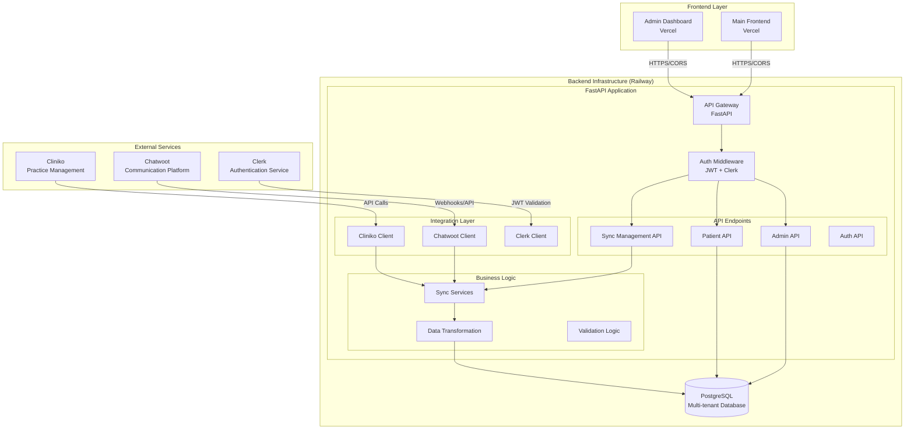

# RoutIQ Backend - Technical Architecture

## Overview
RoutIQ is a **multi-tenant healthcare SaaS platform** that consolidates patient data from healthcare practice management systems and communication tools into a unified dashboard. It serves as a data synchronization and API layer between external healthcare services and frontend applications.

## High-Level Architecture



## Technology Stack

### Core Framework
- **Backend**: FastAPI (Python 3.11)
- **Database**: PostgreSQL with asyncpg driver
- **Deployment**: Railway (containerized with Docker)
- **Authentication**: Clerk (third-party identity provider)

### Key Dependencies
```
FastAPI 0.104.1          # Modern Python web framework
PostgreSQL + asyncpg     # Async database operations
psycopg2-binary          # Database connectivity  
Pydantic 2.5.1          # Data validation and serialization
uvicorn 0.24.0           # ASGI server
cryptography 41.0.7     # Credential encryption
PyJWT 2.8.0             # JWT token handling
httpx 0.24.1            # Async HTTP client for external APIs
```

## System Components

### 1. API Gateway (`src/api/main.py`)
- **FastAPI application** with auto-generated OpenAPI docs
- **CORS middleware** for frontend integration
- **Global exception handling** and error responses
- **Health check endpoints** for monitoring
- **Modular router organization** by feature

### 2. Authentication Layer (`src/api/auth.py`, `src/integrations/clerk_client.py`)
- **Clerk integration** for user management
- **JWT token validation** for API security
- **Multi-tenant organization context** via headers
- **User session management**

### 3. API Endpoints

#### Patient Management (`src/api/patients.py`)
```
GET    /{org_id}/patients                           # List all patients
GET    /{org_id}/patients/with-appointments         # Detailed patient view
GET    /{org_id}/patients/by-appointment-type/{type} # Filtered patient lists
GET    /{org_id}/patients/appointment-types/summary # Analytics data
GET    /{org_id}/summary                           # Organization summary
```

#### Sync Management (`src/api/sync_manager.py`, `src/api/sync_status.py`)
```
POST   /sync/{org_id}/cliniko/active-patients      # Trigger patient sync
GET    /sync/{org_id}/status                       # Check sync status
GET    /sync/{org_id}/logs                         # Sync operation history
```

#### Administration (`src/api/admin.py`, `src/api/cliniko_admin.py`, `src/api/clerk_admin.py`)
```
POST   /admin/organizations                        # Create organizations
GET    /cliniko/{org_id}/patients                  # Direct Cliniko queries
POST   /clerk/organizations                        # Clerk organization management
```

### 4. Integration Layer

#### Cliniko Integration (`src/integrations/cliniko_client.py`)
- **REST API client** with pagination support
- **Rate limiting** and connection management
- **Credential encryption** and per-org API keys
- **Error handling** for API failures

#### Chatwoot Integration (`src/integrations/chatwoot_client.py`)
- **Communication platform** API client
- **Webhook support** for real-time updates
- **Message and conversation synchronization**

#### Clerk Integration (`src/integrations/clerk_client.py`)
- **Authentication service** integration
- **User and organization management**
- **JWT token validation**

### 5. Business Logic Layer (`src/services/`)

#### Sync Services (`src/services/cliniko_sync_service.py`)
- **Data synchronization orchestration**
- **Patient activity analysis** and scoring
- **Appointment aggregation** and transformation
- **Incremental vs full sync** strategies

#### Data Transformation
- **Patient record normalization** from external formats
- **Phone number standardization** using phonenumbers library
- **Activity status calculation** based on appointment patterns
- **JSON data structure** for complex fields

### 6. Database Layer (`src/database.py`)

#### Multi-Tenant Data Model
```sql
-- Core Entities
patients              # Unified patient records with activity status
organizations         # Healthcare practices (tenants)
users                 # System users linked to organizations
conversations         # Communication threads
messages              # Individual messages within conversations
appointments          # Individual appointment records

-- Integration & Operations
service_integrations  # Enabled services per organization
service_credentials    # Encrypted API keys and credentials
sync_logs             # Data synchronization operation history
audit_logs            # User action and system event tracking
```

#### Data Isolation
- **Organization-based partitioning** for all patient data
- **Foreign key constraints** ensuring data integrity
- **Row-level security** through organization_id filtering

## Data Flow Patterns

### 1. Patient Data Synchronization
```
Cliniko API → HTTP Client → Sync Service → Data Transformation → PostgreSQL → Patient API → Frontend
```

### 2. User Authentication
```
Frontend → Clerk → JWT Token → API Gateway → Middleware → Validated Request → Business Logic
```

### 3. Multi-Tenant Access
```
User Request → JWT Validation → Organization Extraction → Database Query Filtering → Response
```

## Infrastructure & Deployment

### Railway Platform
- **Docker containerization** using Python 3.11-slim base image
- **Automatic deployments** from Git repository
- **Environment variable management** for configuration
- **Health check monitoring** and automatic restarts

### Environment Configuration
```bash
# Core Application
DATABASE_URL              # PostgreSQL connection string
SUPABASE_URL              # Alternative database connection
CREDENTIALS_ENCRYPTION_KEY # For API key encryption

# Authentication
CLERK_SECRET_KEY          # Clerk service authentication

# External Services
CLINIKO_API_KEY           # Per-organization Cliniko credentials
CHATWOOT_API_KEY          # Chatwoot integration credentials

# Operational
APP_ENV                   # Environment (production/development)
ENABLE_SYNC_SCHEDULER     # Background sync scheduling
```

### Performance & Scaling
- **Connection pooling** (5-50 connections per instance)
- **Async database operations** using asyncpg
- **Worker process scaling** (2 workers configured)
- **HTTP timeout management** (300s for sync operations)

## Security Architecture

### Authentication & Authorization
- **Clerk-based identity management** with JWT tokens
- **Organization-based access control** via header validation
- **Encrypted credential storage** using cryptography library
- **Per-tenant data isolation** at database level

### Data Protection
- **CORS configuration** for approved frontend domains
- **Input validation** using Pydantic models
- **SQL injection protection** through parameterized queries
- **Healthcare compliance** considerations for HIPAA

## Integration Patterns

### Real-time vs Batch Synchronization
- **Manual triggers** for immediate sync needs
- **Scheduled background jobs** for regular updates
- **Incremental sync** based on last update timestamps
- **Webhook support** for real-time communication updates

### Error Handling & Resilience
- **Graceful degradation** when external services are unavailable
- **Retry mechanisms** with exponential backoff
- **Comprehensive logging** for debugging and monitoring
- **Partial sync recovery** to handle large dataset interruptions

## Monitoring & Observability

### Health Checks
- **Application health** via `/health` endpoint
- **Database connectivity** validation
- **External service** credential verification

### Logging
- **Structured logging** using Python's logging module
- **Request/response logging** for API calls
- **Sync operation tracking** with detailed progress logs
- **Error tracking** with stack traces

## Scalability Considerations

### Current Limitations
- **Single-instance deployment** on Railway
- **Synchronous sync operations** may timeout with large datasets
- **In-memory processing** for data transformation

### Future Scaling Strategies
- **Horizontal scaling** with multiple Railway instances
- **Background job processing** with Celery + Redis
- **Database read replicas** for read-heavy workloads
- **Caching layers** for frequently accessed data

---

## Architecture Decision Records (ADRs)

### ADR-001: FastAPI Framework Choice
**Decision**: Use FastAPI over Django/Flask
**Rationale**: 
- Native async support for database operations
- Automatic OpenAPI documentation generation
- Modern Python type hints and Pydantic integration
- High performance for API-heavy workloads

### ADR-002: Multi-Tenant Architecture
**Decision**: Single database with organization_id partitioning
**Rationale**:
- Simpler deployment and maintenance
- Cost-effective for smaller tenant counts
- Easier data backup and migration
- Future migration to separate databases possible

### ADR-003: External Authentication (Clerk)
**Decision**: Use Clerk instead of custom authentication
**Rationale**:
- Reduces development and maintenance overhead
- Enterprise-grade security features
- Built-in organization management
- HIPAA compliance capabilities

### ADR-004: Railway Deployment Platform
**Decision**: Deploy on Railway instead of AWS/GCP
**Rationale**:
- Simplified deployment pipeline
- Automatic SSL and domain management
- Cost-effective for MVP stage
- Easy environment management 