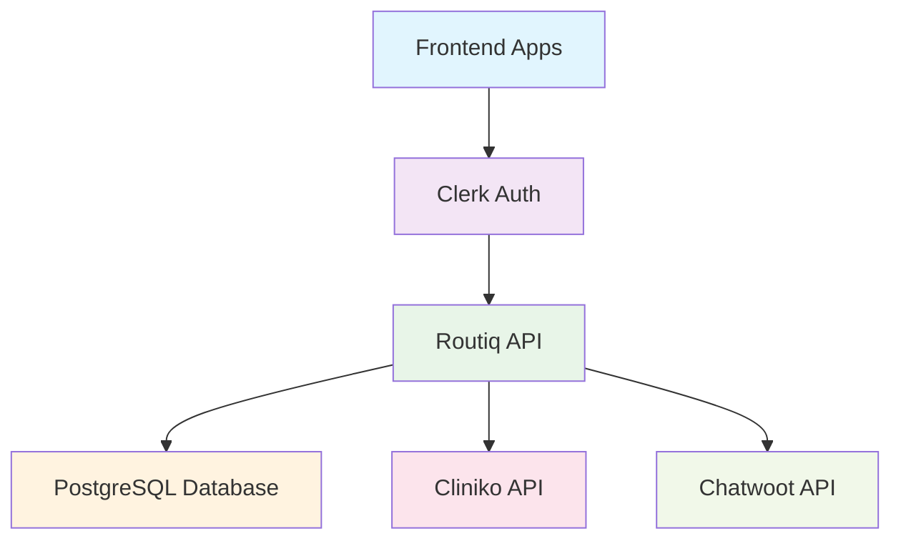

## What is Routiq?

Routiq is a **comprehensive healthcare SaaS platform** that unifies practice management, patient communication, and intelligent analytics. Our API enables healthcare practices to:

- 🔄 **Sync patient data** from multiple practice management systems
- 📊 **Analyze patient activity** with intelligent algorithms  
- 💬 **Integrate communication** tools for better patient engagement
- 🏢 **Manage multiple organizations** with secure multi-tenancy

<CardGroup cols={2}>
  <Card
    title="Quick Start"
    icon="rocket"
    href="/quickstart"
  >
    Get up and running in under 5 minutes
  </Card>
  <Card
    title="API Reference"
    icon="code"
    href="/api-reference"
  >
    Explore all available endpoints
  </Card>
  <Card
    title="Authentication"
    icon="shield-halved"
    href="/authentication"
  >
    Secure your API requests with Clerk JWT
  </Card>
  <Card
    title="Integrations"
    icon="plug"
    href="/integrations/cliniko"
  >
    Connect with Cliniko, Chatwoot, and more
  </Card>
</CardGroup>

## Key Features

<AccordionGroup>
  <Accordion title="🏢 Multi-Tenant Architecture">
    Complete data isolation between healthcare organizations. Each practice's data is securely separated with organization-level access controls.
  </Accordion>

  <Accordion title="🔄 Real-Time Sync">
    Automatic synchronization with practice management systems like Cliniko. Track sync progress in real-time with detailed status updates.
  </Accordion>

  <Accordion title="📊 Smart Patient Analytics">
    Intelligent patient activity analysis based on appointment history. Identify active patients, upcoming appointments, and engagement patterns.
  </Accordion>

  <Accordion title="🔐 Enterprise Security">
    Clerk JWT authentication with organization-level permissions. Industry-standard security practices for healthcare data protection.
  </Accordion>
</AccordionGroup>

## Architecture Overview



## Getting Started

<Steps>
  <Step title="Check API Status">
    Verify the API is running and healthy
    ```bash
    curl https://routiq-backend-prod.up.railway.app/health
    ```
  </Step>
  <Step title="Get Authentication">
    Set up Clerk JWT authentication for your application
  </Step>
  <Step title="Configure Organization">
    Set your organization ID and configure integrations
  </Step>
  <Step title="Start Syncing">
    Begin importing and analyzing patient data
  </Step>
</Steps>

## Popular Use Cases

<CardGroup cols={1}>
  <Card title="Dashboard Integration" icon="chart-line">
    Build comprehensive practice dashboards with real-time patient analytics and sync status monitoring.
  </Card>
  <Card title="Patient Communication" icon="comments">
    Integrate with Chatwoot for automated patient messaging based on appointment schedules and activity.
  </Card>
  <Card title="Practice Analytics" icon="chart-bar">
    Analyze patient engagement, appointment patterns, and practice performance metrics.
  </Card>
  <Card title="Multi-Location Management" icon="building">
    Manage multiple practice locations with unified patient data and separate organizational controls.
  </Card>
</CardGroup>

## API Highlights

- **Base URL**: `https://routiq-backend-prod.up.railway.app`
- **Version**: `v2.0.0` (all endpoints prefixed with `/api/v1/`)
- **Authentication**: Clerk JWT with Bearer tokens
- **Response Format**: JSON with consistent error handling
- **Rate Limiting**: Generous limits for healthcare workflows

<Tip>
  **New to our API?** Start with the [Quick Start Guide](/quickstart) to get your first API call working in minutes.
</Tip>

<Warning>
  **Healthcare Data**: This API handles sensitive healthcare information. Ensure compliance with HIPAA, GDPR, and other relevant regulations in your implementation.
</Warning> 