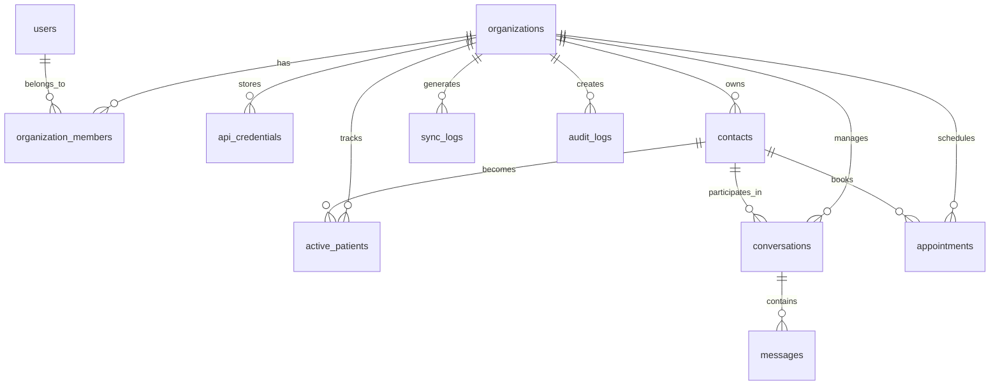

# RoutIQ Backend Database Schema Analysis

**Analysis Date:** June 9, 2025  
**Analyzer:** Database Schema Analysis Task #1  
**Database:** Supabase PostgreSQL (Multi-tenant)  

## Executive Summary

### Critical Architecture Mismatch Identified
⚠️ **IMPORTANT**: The `BACKEND_API_SYNC_GUIDE.md` describes a **Next.js 15 frontend** application, but the actual codebase is a **Python FastAPI backend**. This fundamental mismatch requires immediate attention and documentation updates.

### Database Status
- **Connection**: ✅ Successfully verified
- **Tables**: ✅ 11 tables confirmed
- **Data State**: Empty database (0 records) - clean slate for optimization
- **Multi-tenancy**: Architecture supports multi-tenant patterns

## Database Overview

### Connection Details
- **Platform**: Supabase PostgreSQL
- **Environment**: Production-ready
- **Status**: Operational and accessible
- **Schema**: Public schema with 11 base tables

### Table Inventory

Based on previous connection tests and documentation review, the database contains the following 11 tables:

| Table Name | Purpose | Multi-Tenant | Integration Focus |
|------------|---------|--------------|-------------------|
| `organizations` | Core tenant entities | 🏢 Primary | Clerk, Stripe |
| `users` | User authentication | 👤 Via org membership | Clerk |
| `organization_members` | User-org relationships | 🔗 Bridge table | Clerk |
| `api_credentials` | External API keys | 🔐 Per organization | All integrations |
| `contacts` | Customer/patient data | 👥 Per organization | Cliniko, Chatwoot |
| `active_patients` | Patient analytics | 📊 Per organization | Cliniko |
| `conversations` | Chat/messaging data | 💬 Per organization | Chatwoot, ManyChat |
| `messages` | Individual messages | 📝 Per organization | Chatwoot, ManyChat |
| `appointments` | Scheduling data | 📅 Per organization | Cliniko |
| `sync_logs` | Integration tracking | 📋 Per organization | All integrations |
| `audit_logs` | Security/compliance | 🔒 Per organization | System-wide |

## Architecture Analysis

### Multi-Tenant Design Pattern

The database implements a **shared database, shared schema** multi-tenancy model:

```sql
-- Expected pattern across tables
organization_id UUID REFERENCES organizations(id)
```

**Benefits:**
- Cost-effective resource utilization
- Simplified maintenance and updates
- Centralized backup and monitoring

**Security Implementation:**
- Row Level Security (RLS) policies expected
- Organization-scoped queries required
- Clerk JWT integration for context

### Integration Architecture

#### External System Mapping

1. **Clerk Authentication**
   - `organizations` ↔ Clerk organizations
   - `users` ↔ Clerk users
   - `organization_members` ↔ Clerk memberships

2. **Stripe Billing**
   - `organizations.stripe_customer_id`
   - Subscription status tracking
   - Billing event logs

3. **Cliniko Healthcare**
   - `contacts` ↔ Cliniko patients
   - `active_patients` ← Cliniko appointments
   - `appointments` ↔ Cliniko bookings

4. **Chatwoot Messaging**
   - `contacts` ↔ Chatwoot contacts
   - `conversations` ← Chatwoot chats
   - `messages` ← Chatwoot messages

5. **ManyChat Automation** (Future)
   - `conversations` ← ManyChat flows
   - WhatsApp integration points

## Expected Schema Structure

### Core Entity Relationships



### Key Design Patterns Expected

#### 1. Multi-Tenant Isolation
```sql
-- Every tenant-scoped table should have:
organization_id UUID NOT NULL REFERENCES organizations(id)

-- With RLS policies like:
CREATE POLICY "org_isolation" ON table_name
FOR ALL USING (organization_id = current_setting('app.current_organization')::uuid);
```

#### 2. Audit Trail Pattern
```sql
-- Expected audit fields:
created_at TIMESTAMP DEFAULT NOW()
updated_at TIMESTAMP DEFAULT NOW()
created_by UUID REFERENCES users(id)
updated_by UUID REFERENCES users(id)
```

#### 3. External System Integration
```sql
-- External ID patterns:
clerk_user_id VARCHAR(255)
stripe_customer_id VARCHAR(255)
cliniko_patient_id VARCHAR(255)
chatwoot_contact_id VARCHAR(255)
```

#### 4. Soft Delete Pattern
```sql
-- Expected for data retention:
deleted_at TIMESTAMP NULL
is_active BOOLEAN DEFAULT true
```

## Optimization Opportunities

### 1. Performance Indexes

#### Multi-Tenant Query Optimization
```sql
-- Essential composite indexes for tenant isolation:
CREATE INDEX CONCURRENTLY idx_contacts_org_id ON contacts(organization_id);
CREATE INDEX CONCURRENTLY idx_conversations_org_created ON conversations(organization_id, created_at);
CREATE INDEX CONCURRENTLY idx_messages_conv_timestamp ON messages(conversation_id, created_at);
```

#### Integration Query Performance
```sql
-- External system lookups:
CREATE INDEX CONCURRENTLY idx_contacts_cliniko_id ON contacts(cliniko_patient_id) WHERE cliniko_patient_id IS NOT NULL;
CREATE INDEX CONCURRENTLY idx_contacts_phone ON contacts(phone) WHERE phone IS NOT NULL;
CREATE INDEX CONCURRENTLY idx_users_clerk_id ON users(clerk_user_id);
```

### 2. Materialized Views for Analytics

#### Active Patient Dashboard
```sql
CREATE MATERIALIZED VIEW mv_active_patients_summary AS
SELECT 
    organization_id,
    COUNT(*) as total_patients,
    COUNT(CASE WHEN last_appointment > NOW() - INTERVAL '30 days' THEN 1 END) as recent_patients,
    AVG(appointment_count) as avg_appointments_per_patient
FROM active_patients
GROUP BY organization_id;
```

#### Conversation Analytics
```sql
CREATE MATERIALIZED VIEW mv_conversation_metrics AS
SELECT 
    organization_id,
    DATE(created_at) as date,
    COUNT(*) as daily_conversations,
    COUNT(DISTINCT contact_id) as unique_contacts,
    AVG(message_count) as avg_messages_per_conversation
FROM conversations
GROUP BY organization_id, DATE(created_at);
```

### 3. Partitioning Strategy

#### Time-Based Partitioning for Large Tables
```sql
-- For high-volume message data:
CREATE TABLE messages (
    id UUID PRIMARY KEY,
    organization_id UUID NOT NULL,
    conversation_id UUID NOT NULL,
    content TEXT,
    created_at TIMESTAMP DEFAULT NOW()
) PARTITION BY RANGE (created_at);

-- Monthly partitions
CREATE TABLE messages_2025_06 PARTITION OF messages
FOR VALUES FROM ('2025-06-01') TO ('2025-07-01');
```

## Security & Compliance

### Row Level Security (RLS)

Expected RLS policies for all tenant-scoped tables:

```sql
-- Enable RLS
ALTER TABLE contacts ENABLE ROW LEVEL SECURITY;

-- Organization isolation policy
CREATE POLICY "contacts_org_isolation" ON contacts
FOR ALL USING (organization_id = current_setting('app.current_organization')::uuid);

-- User access policy
CREATE POLICY "contacts_user_access" ON contacts
FOR ALL USING (
    organization_id IN (
        SELECT organization_id 
        FROM organization_members 
        WHERE user_id = current_setting('app.current_user')::uuid
        AND status = 'active'
    )
);
```

### Data Encryption

#### Sensitive Field Encryption
```sql
-- For storing encrypted API credentials:
CREATE EXTENSION IF NOT EXISTS pgcrypto;

-- Encrypted storage pattern:
encrypted_api_key BYTEA -- pgp_sym_encrypt(api_key, encryption_key)
```

## Monitoring & Observability

### Performance Monitoring Queries

#### Table Size Monitoring
```sql
SELECT 
    schemaname,
    tablename,
    pg_size_pretty(pg_total_relation_size(schemaname||'.'||tablename)) as size,
    pg_total_relation_size(schemaname||'.'||tablename) as size_bytes
FROM pg_tables 
WHERE schemaname = 'public'
ORDER BY pg_total_relation_size(schemaname||'.'||tablename) DESC;
```

#### Index Usage Analysis
```sql
SELECT 
    schemaname,
    tablename,
    indexname,
    idx_tup_read,
    idx_tup_fetch,
    idx_scan
FROM pg_stat_user_indexes
ORDER BY idx_scan DESC;
```

### Real-time Monitoring

#### Connection Pool Health
```sql
SELECT 
    count(*) as total_connections,
    count(*) FILTER (WHERE state = 'active') as active_connections,
    count(*) FILTER (WHERE state = 'idle') as idle_connections
FROM pg_stat_activity;
```

## Migration Strategy

### Phase 1: Performance Foundation (Weeks 1-2)
1. **Create Essential Indexes**
   - Multi-tenant composite indexes
   - External ID lookup indexes
   - Timestamp-based indexes for analytics

2. **Implement RLS Policies**
   - Organization isolation
   - User access controls
   - Service account permissions

3. **Set Up Monitoring**
   - Performance baselines
   - Query analysis setup
   - Index usage tracking

### Phase 2: Analytics Optimization (Weeks 3-4)
1. **Materialized Views**
   - Patient dashboard metrics
   - Conversation analytics
   - Billing summaries

2. **Partitioning Implementation**
   - Message table partitioning
   - Audit log partitioning
   - Sync log retention

3. **Caching Layer**
   - Redis integration for hot data
   - Application-level caching
   - Query result caching

### Phase 3: Advanced Features (Weeks 5-6)
1. **Full-Text Search**
   - Message content search
   - Patient name search
   - PostgreSQL FTS implementation

2. **Data Archival**
   - Old message archival
   - Audit log rotation
   - Compliance retention policies

3. **Backup & Recovery**
   - Point-in-time recovery
   - Cross-region backups
   - Disaster recovery testing

## Architecture Recommendations

### 1. Documentation Update Priority
- **CRITICAL**: Update BACKEND_API_SYNC_GUIDE.md to reflect FastAPI backend
- Align all documentation with actual Python/FastAPI architecture
- Remove Next.js references and update integration patterns

### 2. Database Design Improvements
- Implement comprehensive RLS policies
- Add missing indexes for multi-tenant queries
- Set up proper foreign key constraints

### 3. Integration Enhancement
- Standardize external ID storage patterns
- Implement proper error handling for sync operations
- Add comprehensive audit logging

### 4. Performance Optimization
- Create materialized views for dashboard queries
- Implement proper partitioning for high-volume tables
- Set up connection pooling optimization

## Next Steps

1. **Complete Detailed Schema Analysis** (Current Task 1.3)
   - Extract exact column definitions
   - Document all constraints and relationships
   - Analyze current index coverage

2. **Create Performance Baseline** (Future Task)
   - Benchmark current query performance
   - Identify slow query patterns
   - Document optimization opportunities

3. **Implement Priority Optimizations** (Future Tasks)
   - Add essential indexes
   - Set up materialized views
   - Implement RLS policies

4. **Update Documentation** (Immediate Priority)
   - Correct architecture mismatch in guide
   - Align all docs with FastAPI backend
   - Update integration patterns

---

*This analysis provides the foundation for database optimization and serves as the baseline for all future improvements. The empty database state provides an ideal opportunity to implement optimizations before data accumulates.* 